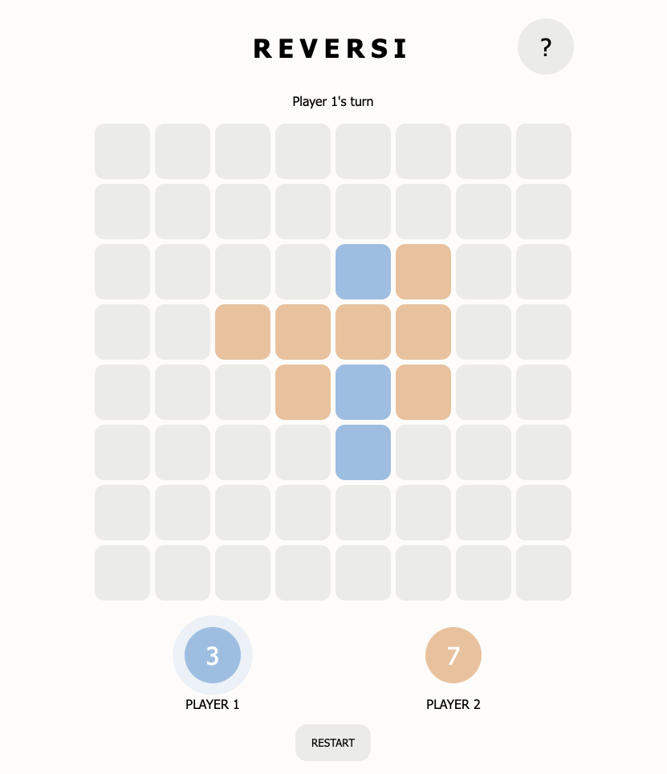

# 	Reversi - GA Project 1



## Overview
_Reversi_ is a strategy board game for two players, played on an 8x8 grid. The aim of the game is to get more pieces on the board than your opponent. You flip your opponent's pieces by trapping them between two of your own. This was a solo project and my first project in the General Assembly Software Engineering course. 

> **Duration:** 7 days \
> **Technologies:** HTML, CSS, JavaScript 

The game is deployed on GitHub pages and available to play here &rarr; https://eliselarooy.github.io/Reversi/

## The Brief
Create a grid-based game using HTML, CSS and JavaScript. The game needs to be rendered in the browser and deployed online to be publicly accessible.

The requirements stated that: 
- The game should be playable for two players on the same computer, taking turns to make their moves
- The winner should be displayed when the game is over

## Approach
### Planning
I started by wire-framing and breaking the project down into smaller manageable pieces. I first sketched out how I wanted the game to look which gave me an idea of the layout and the elements needed in the HTML file. Next, I began to pseudocode the functionality and game logic. I recognised that the main challenge would be designing the logic to determine the valid moves for each turn. 

### Functionality
The 8x8 grid was initialised using a nested _for loop_ to give each cell an x- and a y-reference which would help to simplify the game logic later. I ended up restructuring this as an array of objects to make it easier to store and access properties for each cell. 

```javascript
const createBoard = () => {
  for (let y = 0; y < 8; y++) {
    for (let x = 0; x < 8; x++) {
      const index = coordsToIndex(x, y);
      const element = document.createElement('div');
      grid.appendChild(element);

      element.onclick = () => {
        onClick(x, y);
      };

      const square = {
        x: x,
        y: y,
        disc: null,
        element: element,
        discElement: null,
      };

      cells[index] = square;
    }
  }

  createDisc('b', 27);
  createDisc('b', 36);
  createDisc('w', 28);
  createDisc('w', 35);
};
```

The entire game hinges on the logic for determining valid moves. The move is only valid if the cell: 
- does not already contain a disc
- is adjacent to an opponent’s disc
- results in trapping at least one of your opponent’s discs between two of your own discs 

If these conditions are met in at least one direction, the cell is a valid move. The code snippet below takes the coordinates for the current cell and then tests each direction by altering the x- and y-values. If the next cell is empty (disc === null), the direction is invalid. If the cell contains an opponent’s disc, the move is potentially valid, so we step again in that direction. If the opponent’s disc(s) is followed by a disc of your own, that direction is valid!

```javascript
const checkIsValidMove = (currentPlayer, x, y) => {
  const clickedSquare = getSquareForCoords(x, y);
  if (clickedSquare.disc !== null) {
    return false;
  }

  const directions = [
    { x: -1, y: 0 }, // left
    { x: 1, y: 0 }, // right
    { x: 0, y: -1 }, // up
    { x: 0, y: 1 }, // down
    { x: -1, y: -1 }, // up-left
    { x: 1, y: -1 }, // up-right
    { x: -1, y: 1 }, // down-left
    { x: 1, y: 1 }, // down-right
  ];

  const validDirections = directions.filter((direction) => {
    let hasFoundOpponentDisc = false;

    let currentX = x + direction.x;
    let currentY = y + direction.y;

    while (isOnBoard(currentX, currentY)) {
      const square = getSquareForCoords(currentX, currentY);

      // no disc
      if (square.disc === null) {
        return false;
      }

      // players disc
      if (square.disc === currentPlayer) {
        // valid move if player has trapped an opponent's disc
        return hasFoundOpponentDisc;
      }

      // opponent's disc
      if (square.disc !== currentPlayer) {
        hasFoundOpponentDisc = true;
      }

      currentX = currentX + direction.x;
      currentY = currentY + direction.y;
    }

    return false;
  });

  // the move is valid if there is at least one direction that captures a disc!
  return validDirections.length > 0;
};
```

When the player clicks a cell, I reused this logic to check that the clicked cell is valid, gathered the valid directions, and flipped the opponent’s discs in those directions. 

I then created the logic to determine if the game was over. The game is over when neither player can make a move. If the current player cannot make a move, there is a check for if the game is over. If the game isn’t over, the play switches to their opponent. 

### Styling
On the final day of the project, I tidied up my JavaScript code and focussed on styling. I wanted the game to look clean and minimalistic. In keeping with this, I made the discs fill the entire cell and kept animations to a minimum, only adding them where I thought it helped make the game more intuitive. To help the user see the effects of their move, I added an animation to slow down the disc placing and flipping of the opponent’s discs. I also tidied up the score display and added a pulsing effect to indicate the current player. 

Media queries were added to adjust the game size for different screen sizes. The game should be playable on all screens with a minimum width of 360px.

## Wins and Blockers
As this was my first coding project, the biggest win from this project was my increased understanding of JavaScript. 

The main blocker was creating the logic for determining a valid move as this was necessary for most of the game’s functionality and made it challenging to build the game up incrementally. Once this was achieved, it was just a matter of building logic around this to create the gameplay and win logic. 

## Future Improvements
- Add a popup message to indicate when a player is unable to make a move and skips a turn
- Improve the display of the game over message and winner
- Make a single-player mode, perhaps with the computer selecting a valid move at random or the move that results in most discs being flipped to their colour

## Key Learnings
I am pleased with how my project turned out and learned a lot from using objects and different types of loops in JavaScript. My key takeaways from this project are the importance of planning, writing pseudocode, and breaking a problem down into smaller pieces. 
